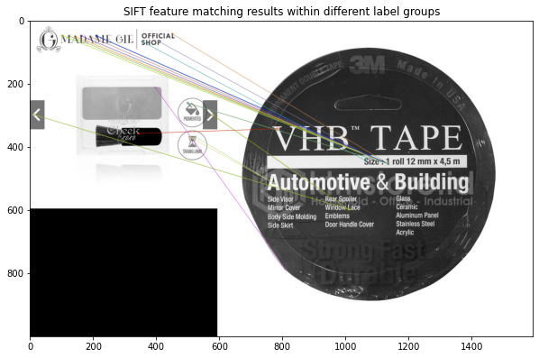
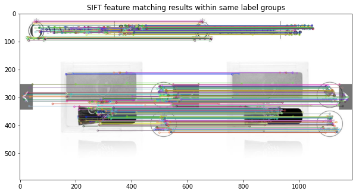
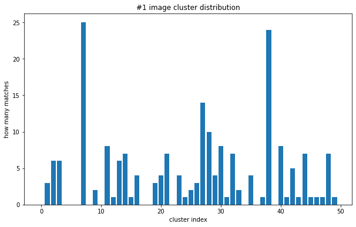
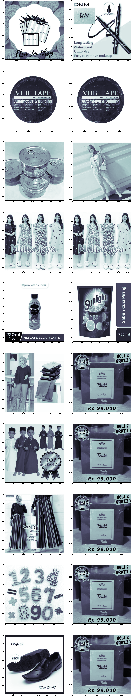
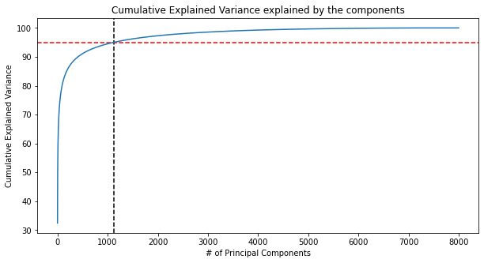

# Practice for Content Based Image Retrieval (Engaging...)
This project is a practice for 'pattern recognition' class, analyzing CBIR problem.
The dataset used in here is shopee-product-matching from [Shopee - Price Match Guarantee](https://www.kaggle.com/c/shopee-product-matching/overview).

First of all, thanks for some developers to share clean explanation and their codes. This work is mainly designed on the bases they already made, and I put some my own changes or experiments to study. About where I've referred these information, I'll write at the bottom of this document.

As a beginner, I hope to be good at Github, as well as studying throughout this work.

## Prerequisites
This project is desined and tested on virtual-environment, Anaconda, on Windows. I recommend you to setup in virtual-environment as well to protect your own development environment. 
* CUDA 10.1
* cuDNN 7.6
* Python 3.8.8
* Pytorch 1.8.1
* Shopee-product-matching dataset (Dataset is available at [Shopee-product-matching](https://www.kaggle.com/c/shopee-product-matching/data))

Plus, since I am still not skillful with dealing memory, it may performs very inefficiently and consuming resources. About this problem, I'll edit some parts to solve. 

## Installation
First of all, create a new virtual-environment, for example, `cbir`. In Anaconda prompt try (I only wrote command-line):

    (base)conda create -n cbir -f requirements.yaml
    (base)conda activate cbir

If you want to run this program with `jupyter notebook`, move to `~~~/Context_Based_Image_Retrieval` and try:

    (cbir)jupyter notebook

The required directory sturcutre is:

```bash
+-- Context_Based_Image_Retrieval/
    +-- shopee-product-matching/
        +-- test_images/
        +-- train_images/
        +-- train.csv
        +-- test.csv
        +-- ...
    +-- sift_materials_svm/
    +-- pca_feature_materials/
    +-- sift_svm_materials/
    +-- img/
    +-- pca_image.py
    +-- sift_image.py
    +-- tfidf_title.py
    +-- pca_image.ipynb
    +-- sift_image.ipynb
    +-- tfidf_title.ipynb
    +-- requirements.yaml
    +-- README.md
```

## Demo

In here, I'll use these methods:
* Principal component analysis (PCA)
  * text info.
  * image info.
* SIFT feature
  * image info.
* Deep-Learning based
  * text info.
  * image info.
  * mixed

## 1. Principal Component Analysis (PCA)

### text info.
In `tfidf_title.py`, you can change the number of samples, N_SAMPLE:

tfidf_title.py
```python
...
N_SAMPLE = 5000
DATA_PATH = 'shopee-product-matching/'
train = pd.read_csv(DATA_PATH + 'train.csv')
...
```
Can start by command below. *(should check your current path)*

    (cbir) python tfidf_title.py

After this, `###_trained_text_feature.csv` will be saved at `pca_feature_materials/` directory, to save time in after running. This file is a calculated features matrix, consuming lots of resources and times. And the `###` of file name means, the number of samples when the file was made.

And we can check this method's score. (not for test_data)

To score trained model, `F1 score`, `Precision`, `Recall` will be used. I used 10000 data as training data (0~9999), the result of training as below:

||F1|Precision|Recall|
|---|---|---|---|
|TEXT info|0.551|0.750|0.538|


### image info.
In `pca_image.py`, you also can change the number of samples, N_SAMPLE. As similar with `tfidf_title.py`, you can start by command below. *(should check your current path)*

    (cbir) python pca_image.py

The result below is produced from 5000 training samples (0~5999):

||F1|Precision|Recall|
|---|---|---|---|
|IMAGE info|0.768|0.847|0.766|


## 2. SIFT feature
Because SIFT features are describing some points in the image, I didn't prepare about text information here. For running this:

    (cbir) python sift_image.py

And this has some figures showing the result of feature matching. 

<p align="center"> 
 
</p>
<p align="center"> 
 
</p>

These figures show the feature matching result as an example, between different label groups and same label groups.

It also has a clustering process and uses them to make new feature to train SVM model. Every single SIFT feature point will be divided by clusters, and the SIFT feature points in one image will be counted. 
<p align="center"> 
 
</p>


After you did, svm model files will be saved at `sift_svm_materials/`. For example, `svm_model.m` and `##svm_centers_.npy` files will be saved at `sift_svm_materials/`. About the process of this code, please refer next section.

<p align="center"> 
 
</p>

Left side is input (query) image, and right one is output. Indeed, this program will predict a `label_group` with given images, but just to make more easier to figure out what the label is, it shows one image from **predicted label**.

And the score is,

||F1|Precision|Recall|
|---|---|---|---|
|IMAGE info|0.123|0.200|0.089|

## 3. Deep-Learning Based


## 1. Principal Component Analysis (PCA)
In here, text (item title) and image information will be used to extracting feature from given dataset. All of codes are written in `anaconda`. About installing environments, will be explained later. 

### tfidf_title.ipynb


For extracting feature from text data, I used `TF-IDF` features. `TF-IDF` is short-term of `Term Frequency - Inverse Document Frequency`. It mainly focuses on how frequent the word appears, and also considers whether the word is also appeared in other sample. If so, the importance of the word will be decreased as well. 

Because every word in the whole dataset is not quite repeatedly, dimension of original feature is huge, probably causing the curse of dimensionality. To tackle with this, I used PCA to decrease original `n`-dim feature into `k`-dim feature. (n > k)

To satisfy performance simultaneously, there is searching `k` value which can explain more than 95% of original features' variance. In graph below, since it seems like still has great dimension, you can also consider lower `k`.

<p align="center"> 
 
</p>

<p align="center"> 
 
</p>

# REFERENCE
```
https://www.kaggle.com/mirzarahim/introduction-to-pca-image-compression-example
https://github.com/vivekrmk/Image-Compression-Principal-Component-Analysis-Pytorch
https://github.com/Erikfather/PCA-python
https://wikidocs.net/24603
https://www.kaggle.com/finlay/unsupervised-image-text-baseline-in-20min
```
