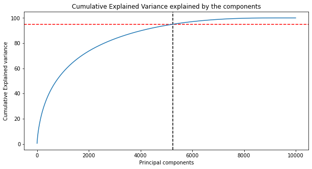

# Practice for Content Based Image Retrieval (Engaging...)
This project is a practice for 'pattern recognition' class, analyzing CBIR problem.
The dataset used in here is shopee-product-matching from [Shopee - Price Match Guarantee](https://www.kaggle.com/c/shopee-product-matching/overview).

First of all, I've been helped a lot from other codes, refering:

```
https://www.kaggle.com/mirzarahim/introduction-to-pca-image-compression-example
https://github.com/vivekrmk/Image-Compression-Principal-Component-Analysis-Pytorch
https://github.com/Erikfather/PCA-python
https://wikidocs.net/24603
```

In here, I'll engage in:
* Principal component analysis (PCA)
* SIFT feature
* Deep-Learning based

As a beginner, I hope to be good at Github, as well as studying throughout this work.

## Dependencies
For development environment, it will need:
* CUDA 10.1
* cuDNN 7.6
* Python 3.5-3.8
* Tensorflow(_gpu)-2.3.0


## 1. Principal Component Analysis (PCA)
In here, text (item title) and image information will be used to extracting feature from given dataset. All of codes are written in `anaconda`. About installing environments, will be explained later. 

### tfidf_title.ipynb

To score trained model, `F1 score`, `Precision`, `Recall` will be used. I used 10000 data as training data (0~9999), the result of training as below:

||F1|Precision|Recall|
|---|---|---|---|
|TEXT info|0.551|0.750|0.538|

For extracting feature from text data, I used `TF-IDF` features. `TF-IDF` is short-term of `Term Frequency - Inverse Document Frequency`. It mainly focuses on how frequent the word appears, and also considers whether the word is also appeared in other sample. If so, the importance of the word will be decreased as well. 

Because every word in the whole dataset is not quite repeatedly, dimension of original feature is huge, probably causing the curse of dimensionality. To tackle with this, I used PCA to decrease original `n`-dim feature into `k`-dim feature. (n > k)

To satisfy performance simultaneously, there is searching `k` value which can explain more than 95% of original features' variance. In graph below, since it seems like still has great dimension, you can also consider lower `k`.

<p align="center"> 
 
</p>
